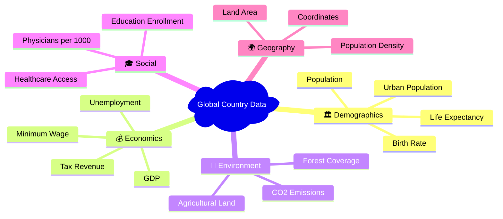
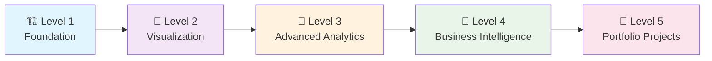

# 🌍 Global Country Information Dataset 2023

<div align="center">


**A comprehensive data science playground for analyzing global country statistics and building world-class analytical skills**

[🚀 Quick Start](#-quick-start) • [📊 Dataset Overview](#-dataset-overview) • [🎯 Learning Path](#-learning-roadmap) • [📈 Portfolio Projects](#-portfolio-showcase)

</div>

---

## 📖 **Project Overview**

This repository transforms raw global country data into actionable insights through systematic data analysis. Perfect for **data science practitioners**, **portfolio builders**, and **analytics enthusiasts** seeking hands-on experience with real-world datasets.

### 🎯 **What You'll Achieve**
- Master **end-to-end data analysis** workflows
- Build **publication-ready visualizations** 
- Develop **machine learning models** for country-level predictions
- Create **business intelligence dashboards**
- Construct a **standout data science portfolio**

---

## 📊 **Dataset Overview**

<div align="center">

| 🌍 **Countries** | 📊 **Features** | 🗂️ **Categories** | 📅 **Year** |
|:---:|:---:|:---:|:---:|
| **196** | **35** | **5 Major Domains** | **2023** |

</div>

### 🏷️ **Data Categories**



---

## 🚀 **Quick Start**

### Prerequisites
```bash
# Clone the repository
git clone https://github.com/your-username/Global-Country-Information-Dataset-2023.git
cd Global-Country-Information-Dataset-2023
```

### Environment Setup
```bash
# Create conda environment
conda env create -f environment.yml
conda activate global-country-data

# Or use Make for quick setup
make install
```

### First Analysis
```bash
# Quick data exploration
make explore

# Start Jupyter notebooks
make notebook

# Generate cleaned dataset
make clean-data
```

---

## 🎯 **Learning Roadmap**

<div align="center">

### 📈 **5-Level Mastery Path**

</div>



| Level | Focus Area | Key Skills | Deliverables |
|:---:|:---|:---|:---|
| **🏗️ 1** | **Data Foundation** | Quality assessment, cleaning, EDA | Clean datasets, quality reports |
| **🎨 2** | **Visualization** | Statistical plots, dashboards, maps | Interactive visualizations |
| **🔬 3** | **Advanced Analytics** | ML clustering, predictive modeling | Trained models, statistical reports |
| **💼 4** | **Business Intelligence** | KPIs, risk assessment, strategy | Executive dashboards, recommendations |
| **🚀 5** | **Portfolio Projects** | Full-stack analytics, research | Web apps, automated systems, papers |

> 📚 **Detailed roadmap**: See [`tasks.md`](tasks.md) for complete learning path with 25+ hands-on exercises

---

## 📁 **Project Structure**

```
📦 Global-Country-Information-Dataset-2023/
├── 📊 data/
│   ├── raw/                    # Original dataset (immutable)
│   └── cleaned/                # Processed, analysis-ready data
├── 🔍 analysis/
│   ├── level_1_foundation/     # Data quality & cleaning
│   ├── level_2_visualization/  # Charts & dashboards
│   ├── level_3_advanced/       # ML & statistics
│   ├── level_4_business/       # BI & strategy
│   └── level_5_portfolio/      # Advanced projects
├── 📓 notebooks/               # Jupyter exploration
├── 📈 results/
│   ├── plots/                  # Publication-ready charts
│   ├── reports/                # Analysis summaries
│   └── dashboards/             # Interactive visualizations
├── 🧪 tests/                   # Data validation
├── 🗄️ sql/                     # Database queries
├── 📋 tasks.md                 # Complete learning roadmap
├── 🔧 Makefile                 # Development commands
└── 🌍 environment.yml          # Conda dependencies
```

---

## 📈 **Portfolio Showcase**

### 🎨 **Sample Visualizations**
<div align="center">

*Coming Soon: Interactive dashboards and geographic visualizations*

| Economic Analysis | Quality of Life | Geographic Patterns |
|:---:|:---:|:---:|
| 📊 GDP vs Development | 🏥 Healthcare Access | 🗺️ Global Heatmaps |
| 💼 Employment Trends | 🎓 Education Impact | 🌍 Regional Clusters |

</div>

### 🔬 **Analytics Projects**
- **🎯 Country Clustering**: Unsupervised segmentation of nations
- **📊 Life Expectancy Prediction**: ML models with feature importance
- **💰 Investment Attractiveness**: Composite scoring system
- **⚡ Risk Assessment**: Multi-dimensional country risk analysis

---

## 🛠️ **Technology Stack**

<div align="center">

| Category | Technologies |
|:---:|:---|
| **🐍 Core** | Python 3.11+, pandas, numpy |
| **📊 Analysis** | scipy, scikit-learn, statsmodels |
| **📈 Visualization** | matplotlib, seaborn, plotly, folium |
| **🗃️ Data** | CSV, potential SQLite integration |
| **📓 Development** | Jupyter, VS Code, conda |
| **⚙️ Automation** | Make, GitHub Actions CI/CD |

</div>

---

## 🚀 **Quick Commands**

```bash
# Development workflow
make install          # Install dependencies
make explore          # Quick data overview  
make notebook         # Start Jupyter server
make clean-data       # Generate cleaned dataset
make stats            # Dataset statistics
make clean            # Remove cache files

# Analysis pipeline
python analysis/main.py              # Run main analysis
jupyter notebook notebooks/         # Interactive exploration
```

---

## 🤝 **Contributing**

We welcome contributions! Whether you're:
- 🐛 **Fixing bugs** in analysis scripts
- 📊 **Adding new visualizations** 
- 🔧 **Improving data processing**
- 📚 **Enhancing documentation**

### How to Contribute
1. Fork the repository
2. Create a feature branch (`git checkout -b feature/amazing-analysis`)
3. Commit your changes (`git commit -m 'Add amazing analysis'`)
4. Push to branch (`git push origin feature/amazing-analysis`)
5. Open a Pull Request

---

## 📄 **License**

This project is licensed under the MIT License - see the [LICENSE](LICENSE) file for details.

---

## 🙏 **Acknowledgments**

- **Dataset Source**: Global country statistics compilation for 2023
- **Community**: Open source data science community
- **Tools**: Amazing Python data science ecosystem

---

<div align="center">

**⭐ Star this repo if it helps your data science journey!**

[](https://github.com/your-username/Global-Country-Information-Dataset-2023)
[](https://github.com/your-username/Global-Country-Information-Dataset-2023/fork)

**Built with ❤️ for the data science community**

</div>